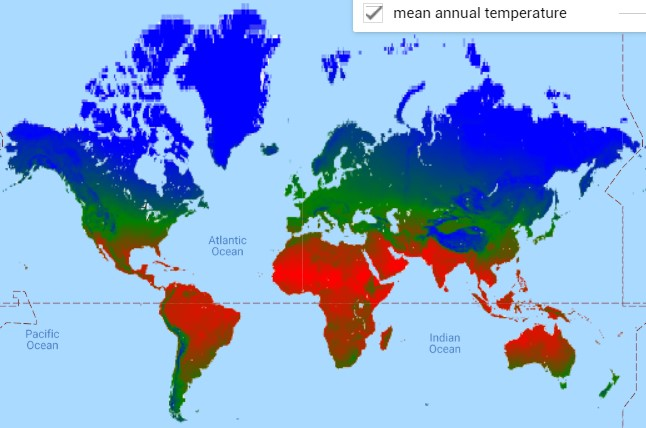
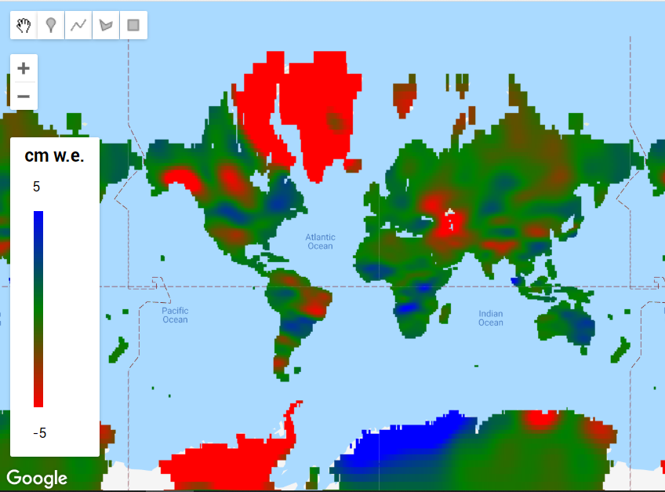
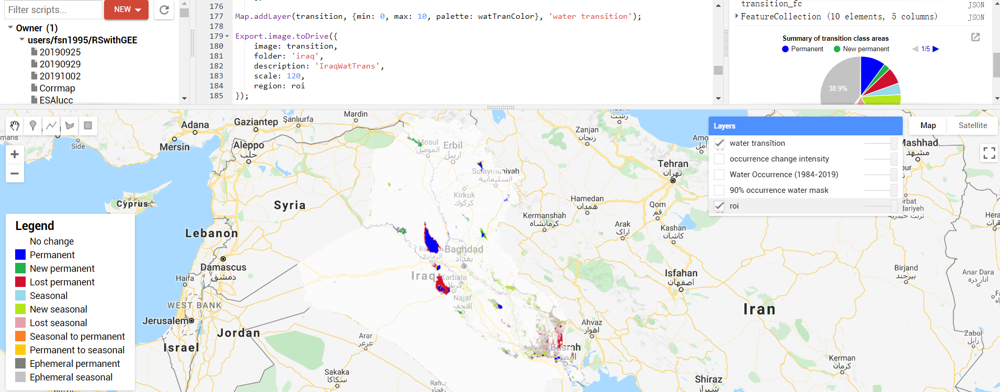
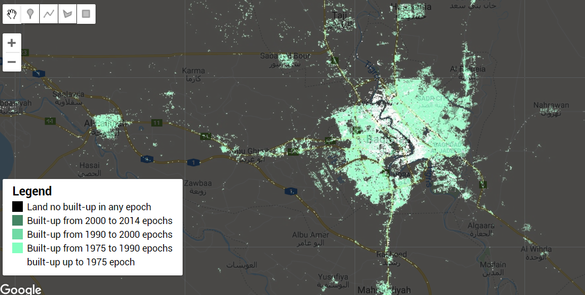
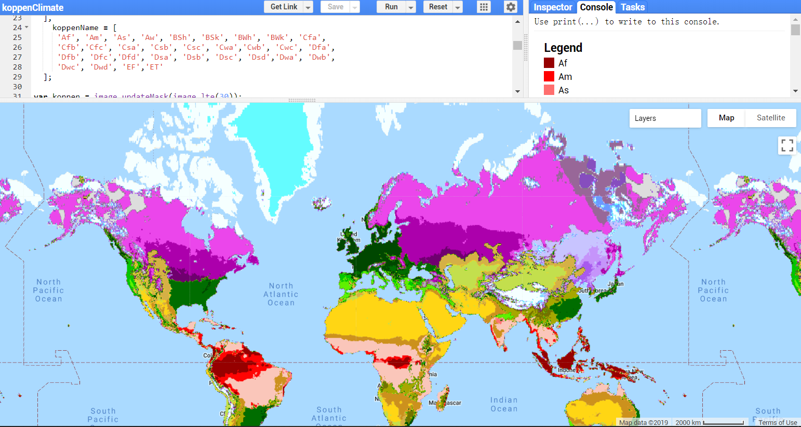
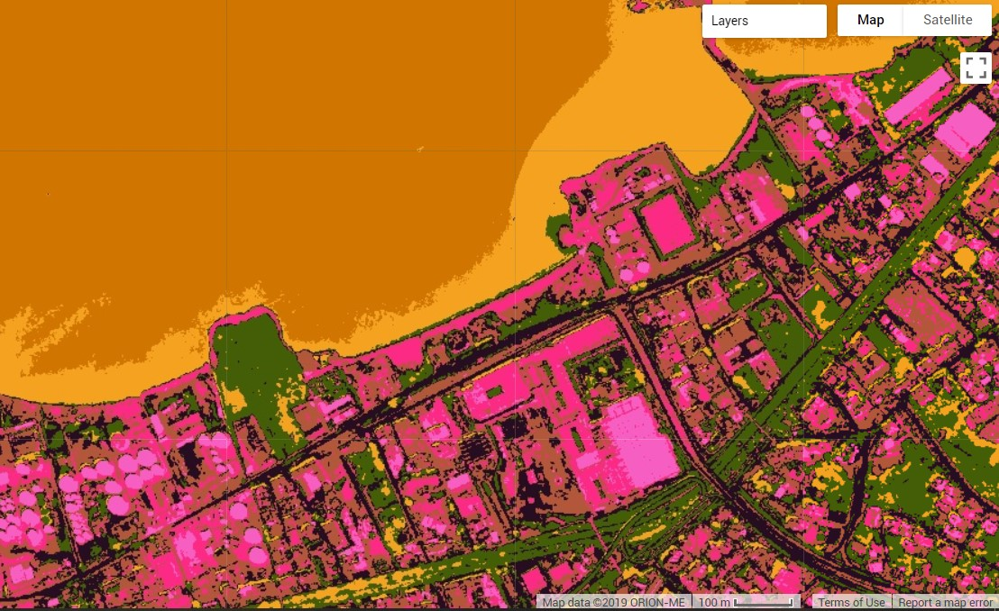

# Fun with GEE
Google Earth Engine self-learning. Here is a collection of GEE javascript practice for myself.
- Start from the official guide and the reference: https://developers.google.com/earth-engine/#api 
- Copy the script and run in the GEE code editor: https://code.earthengine.google.com/ 
## 1. [Mean Annual Temperature/Precipitation - Noah](https://github.com/fsn1995/Fun-with-Google-Earth-Engine/blob/master/Noah.js)
This script computes, displays and exports the mean annual temperature, mean annual precipitation. The selected dateset is NOAH Global Land Assimulation System data.
- The temporal resolution is 3 hours (8 bands per day). Note: the unit of precipitation rate (kg/m^2/s) equals mm/s and is converted by the script. More about the data can be found at: 
- https://developers.google.com/earth-engine/datasets/catalog/NASA_GLDAS_V20_NOAH_G025_T3H 
- https://developers.google.com/earth-engine/datasets/catalog/NASA_GLDAS_V021_NOAH_G025_T3H 

    
## 2. [GRACE](https://github.com/fsn1995/Fun-with-Google-Earth-Engine/blob/master/grace.js)
This script displays the long term average GRACE (the Gravity Recovery and Climate Experiment) data.\
  
## 3. Visualization of Globa Product
This part aims to visualize some of the global product in the GEE's dataset. 
## 3.1 EC JRC/Google Global Product 
Explore the global surface product provided by EC JRC/Google. 
### 3.1.1 [Global Water](https://github.com/fsn1995/Fun-with-Google-Earth-Engine/blob/master/GlobalWater.js)
It would display the global surface water dynamics in your area of interest. 
  
### 3.1.2 Global Water Time Slider
It creates a dateslider to check the [monthly](https://github.com/fsn1995/Fun-with-Google-Earth-Engine/blob/master/GlobalWaterMonthly.js) or [annual](https://github.com/fsn1995/Fun-with-Google-Earth-Engine/blob/master/GloablWaterAnnual.js) water classification . 
  
### 3.1.3 [Global Urban](https://github.com/fsn1995/Fun-with-Google-Earth-Engine/blob/master/GlobalUrban.js)
This script utizes the GHSL: Global Human Settlement Layers, Built-Up Grid 1975-1990-2000-2015 (P2016) data.
  
### 3.2 [Fire Viewer](https://github.com/fsn1995/Fun-with-Google-Earth-Engine/blob/master/FireViewer.js)
It displays the maximum extent of fire events during the study period at specified country. This was used to assist ICRC GIS officers from Lebanon to locate wildfires. The polygons of fire events can be exported via google drive.\
The data is provided by NASA / LANCE / EOSDIS (FIRMS: Fire Information for Resource Management System)
## 4. [koppen climate classification](https://github.com/fsn1995/Fun-with-Google-Earth-Engine/blob/master/koppen.js)
This script displays The Köppen-Geiger climate map with a spatial resolution of 5 arc minutes for the period of 1986-2010. The legend will be displayed in the console.
- http://koeppen-geiger.vu-wien.ac.at/ 
- Link to the shared data: https://code.earthengine.google.com/?asset=users/fsn1995/Global_19862010_KG_5m \
  
## 5. [Trend Analysis](https://github.com/fsn1995/Fun-with-Google-Earth-Engine/blob/master/mannKendall.js)
This script performs Mann-kendall's test to the MODIS NDVI product. The result can be used to indicate the long-term trend of global vegetation (green) trend.\

## 6. [Urban landcover](https://github.com/fsn1995/Fun-with-Google-Earth-Engine/blob/master/unsupervisedPlanetLab.js)
A quick overview of the unsupervised classification with high resolution imagery (Planet Lab).

## 7. [Flood mapping](https://github.com/fsn1995/Fun-with-Google-Earth-Engine/blob/master/MyanmarFlood.js)
A tool to visualize flooded area and summarize the time series of area changes. A video of all the available sentinel 1 images can be exported to google drive.\

# Python API
## 1. [batch upload with command line tool](https://github.com/fsn1995/MatlabFSN/blob/master/GEEuploader.m)
This is just a quick solution to batch upload via the command line tool. It creates a text file with the commands to upload images from google cloud storage bucket and the other text file for defining the timestamp of each image. You will need to install earthengine-api first. Note: Just discovered that each user can only upload maximum 10k images. 
Ref: https://developers.google.com/earth-engine/command_line
# quick link
1) AWESOME geetools by @author: Rodrigo E. Principe https://github.com/fitoprincipe/geetools-code-editor/wiki
2) gee community: 
https://github.com/gee-community/
3) how to add a legend?
https://mygeoblog.com/2016/12/09/add-a-legend-to-to-your-gee-map/
4) how to add a gradient legend?
https://mygeoblog.com/2017/03/02/creating-a-gradient-legend/
