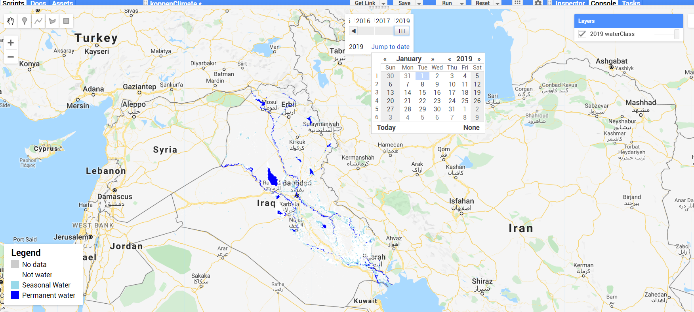

# geeFSN
 Google Earth Engine self-learning. Resources for myself.\
 Start from the official guide and the reference: https://developers.google.com/earth-engine/#api \
 Copy the script and run in the GEE code editor: https://code.earthengine.google.com/
## 1. [Noah](https://github.com/fsn1995/geeFSN/blob/master/Noah.js)
This script computes, displays and exports the mean annual temperature, mean annual precipitation. The selected dateset is NOAH Global Land Assimulation System data.\
The temporal resolution is 3 hours (8 bands per day). Note: the unit of precipitation rate (kg/m^2/s) equals mm/s and is converted by the script. More about the data can be found at: \
https://developers.google.com/earth-engine/datasets/catalog/NASA_GLDAS_V20_NOAH_G025_T3H \
https://developers.google.com/earth-engine/datasets/catalog/NASA_GLDAS_V021_NOAH_G025_T3H
## 2. [grace](https://github.com/fsn1995/geeFSN/blob/master/grace.js)
This script displays the long term average GRACE (the Gravity Recovery and Climate Experiment) data.\
  
## 3. EC JRC/Google Global Product 
Explore the global surface product provided by EC JRC/Google. This part is finished while I am working as the RS and GIS associate at the ICRC.
### 3.1 [GlobalWater](https://github.com/fsn1995/geeFSN/blob/master/GlobalWater.js)
It would display the global surface water dynamics in your area of interest. 
  
### 3.2 [GlobalWaterAnnual](https://github.com/fsn1995/geeFSN/blob/master/GlobalWaterAnnual.js)
It creates a dateslider to check the annual water classification. 
  
### 3.3 [GlobalUrban](https://github.com/fsn1995/geeFSN/blob/master/GlobalUrban.js)
This script utizes the GHSL: Global Human Settlement Layers, Built-Up Grid 1975-1990-2000-2015 (P2016) data.
  
## 4. [koppen climate classification](https://github.com/fsn1995/geeFSN/blob/master/koppen.js)
This script displays The Köppen-Geiger climate map with a spatial resolution of 5 arc minutes for the period of 1986-2010. The legend will be displayed in the console.\
http://koeppen-geiger.vu-wien.ac.at/ \
Link to the shared data:\
https://code.earthengine.google.com/?asset=users/fsn1995/Global_19862010_KG_5m \
  
# quick link
1) gee community: 
https://github.com/gee-community/
2) how to add a legend?
https://mygeoblog.com/2016/12/09/add-a-legend-to-to-your-gee-map/
3) how to add a gradient legend?
https://mygeoblog.com/2017/03/02/creating-a-gradient-legend/

